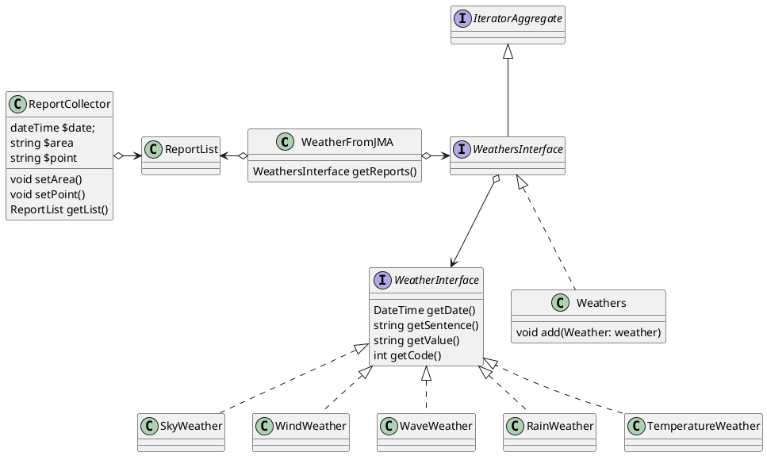

# WeatherFromJMA

## Class Diagram

<!--
2020/10/21 府県天気予報 【東京都府県天気予報】
  区域予報
    Gen2:伊豆諸島南部
      Gen3:天気
        Gen4 Weather Time1:くもり
        Gen4 Weather Time2:くもり後一時雨
        Gen4 Weather Time3:くもり時々雨
        Gen4 WeatherCode Time1:200
        Gen4 WeatherCode Time2:212
        Gen4 WeatherCode Time3:203
      Gen3:風
        Gen4 Wind Sentence: 北東の風　強く　後　東の風　やや強く
        Gen4 Wind Base: 北東強く
        Gen4 Wind Becoming: 東やや強く
        Gen4 Wind Sentence: 東の風　やや強く
        Gen4 Wind Base: 東やや強く
        Gen4 Wind Sentence: 南西の風　やや強く　後　西の風　やや強く
        Gen4 Wind Base: 南西やや強く
        Gen4 Wind Becoming: 西やや強く
      Gen3:波
        Gen4 Wave Base Time1:4.0m(うねり　を伴う)
        Gen4 Wave Base Time2:3.0m(うねり　を伴う)
        Gen4 Wave Base Time3:3.0m(うねり　を伴う)
    Gen2:伊豆諸島南部
      Gen3:降水確率
        Gen4 ChanceOfRain Time1:雨 10%
        Gen4 ChanceOfRain Time2:雨 20%
        Gen4 ChanceOfRain Time3:雨 30%
        Gen4 ChanceOfRain Time4:雨 30%
        Gen4 ChanceOfRain Time5:雨 30%
        Gen4 ChanceOfRain Time6:雨 50%
  地点予報
    Gen2:八丈島
      Gen3:日中の最高気温
        Gen4:日中の最高気温23度
      Gen3:最高気温
        Gen4:最高気温23度
      Gen3:朝の最低気温
        Gen4:朝の最低気温18度
      Gen3:日中の最高気温
        Gen4:日中の最高気温24度
  区域予報
    Gen2:伊豆諸島南部
      Gen3:３時間内卓越天気
        Gen4 Weather Time1:くもり
        Gen4 Weather Time2:くもり
        Gen4 Weather Time3:くもり
        Gen4 Weather Time4:くもり
        Gen4 Weather Time5:くもり
        Gen4 Weather Time6:くもり
        Gen4 Weather Time7:くもり
        Gen4 Weather Time8:くもり
      Gen3:３時間内代表風
        Gen4 WindDirection Time1:北東
        Gen4 WindDirection Time2:北東
        Gen4 WindDirection Time3:東
        Gen4 WindDirection Time4:東
        Gen4 WindDirection Time5:東
        Gen4 WindDirection Time6:東
        Gen4 WindDirection Time7:東
        Gen4 WindDirection Time8:東
        Gen4 WindDirection Time1:風速階級4 Description=毎秒１０メートル以上 Range=10 INF
        Gen4 WindDirection Time2:風速階級4 Description=毎秒１０メートル以上 Range=10 INF
        Gen4 WindDirection Time3:風速階級4 Description=毎秒１０メートル以上 Range=10 INF
        Gen4 WindDirection Time4:風速階級4 Description=毎秒１０メートル以上 Range=10 INF
        Gen4 WindDirection Time5:風速階級4 Description=毎秒１０メートル以上 Range=10 INF
        Gen4 WindDirection Time6:風速階級4 Description=毎秒１０メートル以上 Range=10 INF
        Gen4 WindDirection Time7:風速階級4 Description=毎秒１０メートル以上 Range=10 INF
        Gen4 WindDirection Time8:風速階級4 Description=毎秒１０メートル以上 Range=10 INF
  地点予報
    Gen2:八丈島
      Gen3:３時間毎気温
        Gen4:気温22度
        Gen4:気温21度
        Gen4:気温21度
        Gen4:気温20度
        Gen4:気温20度
        Gen4:気温19度
        Gen4:気温19度
        Gen4:気温22度
        Gen4:気温23度
-->
