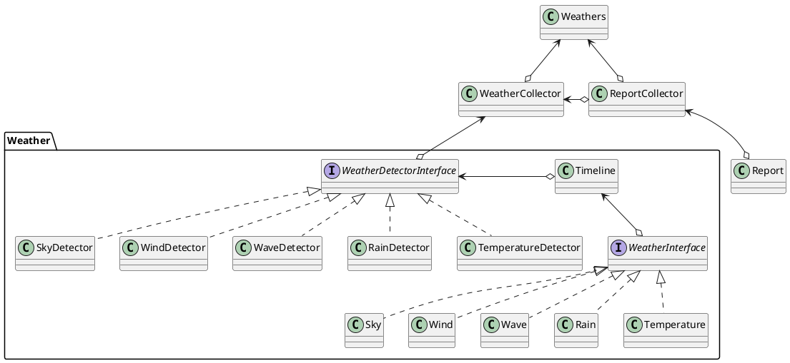

# WeatherFromJMA

## Example

```
$ php ./example/index.php
```

## Class Diagram


```plantuml
@startuml
Weathers <--o WeatherCollector
Weathers <--o ReportCollector
WeatherCollector <-o ReportCollector
WeatherCollector <--o Weather.WeatherDetectorInterface
ReportCollector <--o Report

class Weathers

class WeatherCollector
class ReportCollector
class Report

namespace Weather {
	WeatherDetectorInterface <-o Timeline
	Timeline <--o WeatherInterface

	class Timeline

	interface WeatherDetectorInterface
	class SkyDetector implements WeatherDetectorInterface
	class WindDetector implements WeatherDetectorInterface
	class WaveDetector implements WeatherDetectorInterface
	class RainDetector implements WeatherDetectorInterface
	class TemperatureDetector implements WeatherDetectorInterface

	interface WeatherInterface
	class Sky implements WeatherInterface
	class Wind implements WeatherInterface
	class Wave implements WeatherInterface
	class Rain implements WeatherInterface
	class Temperature implements WeatherInterface
}
@enduml
```
